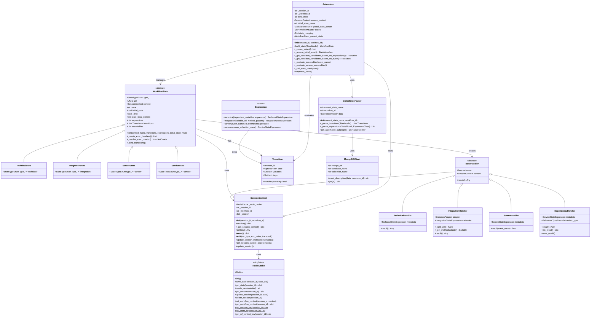
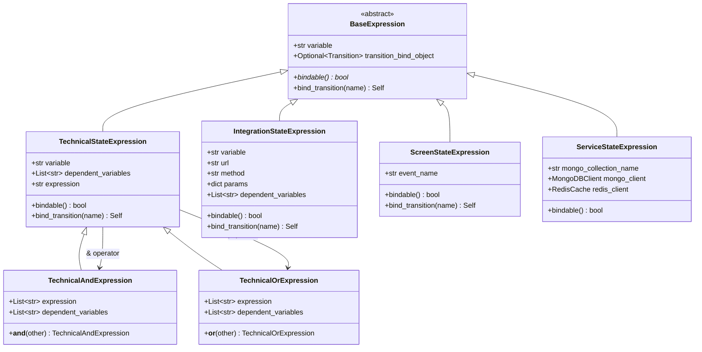
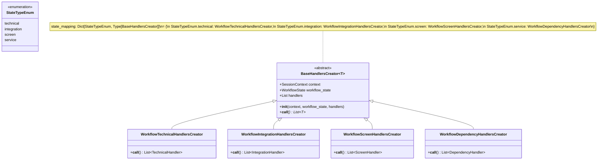
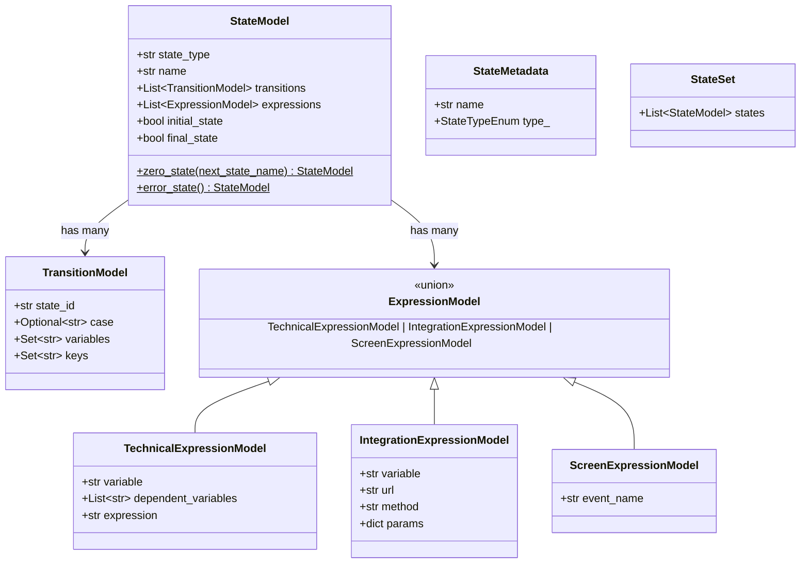
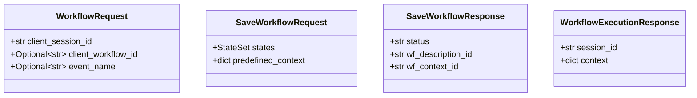
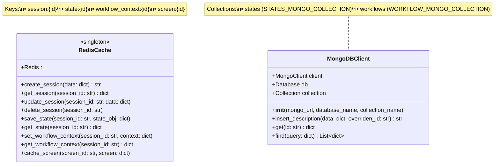
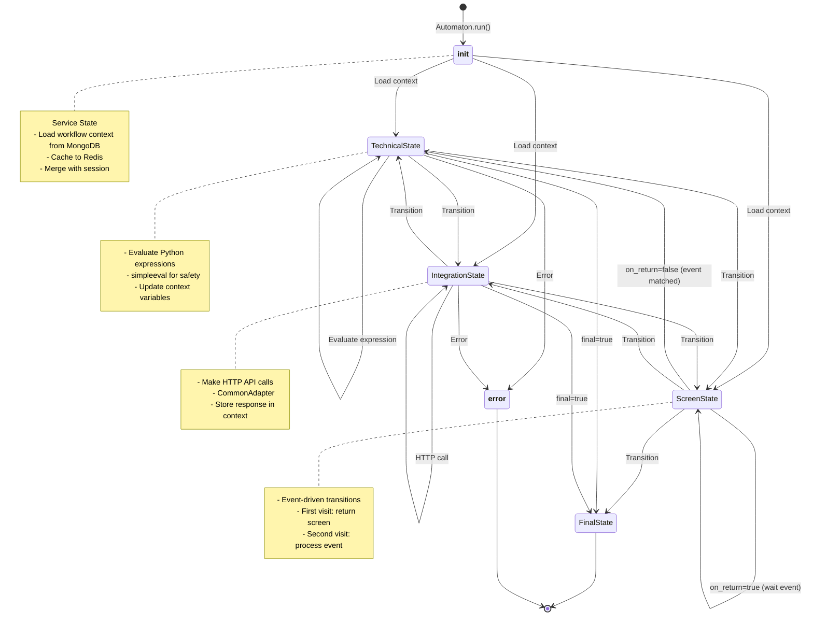
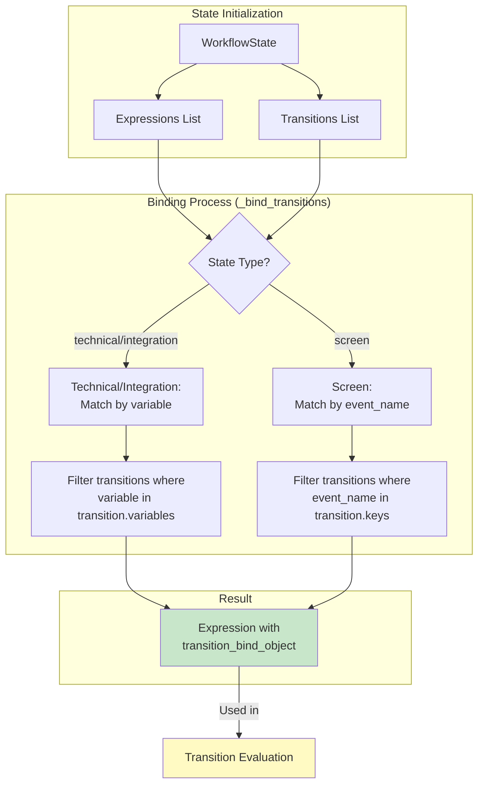
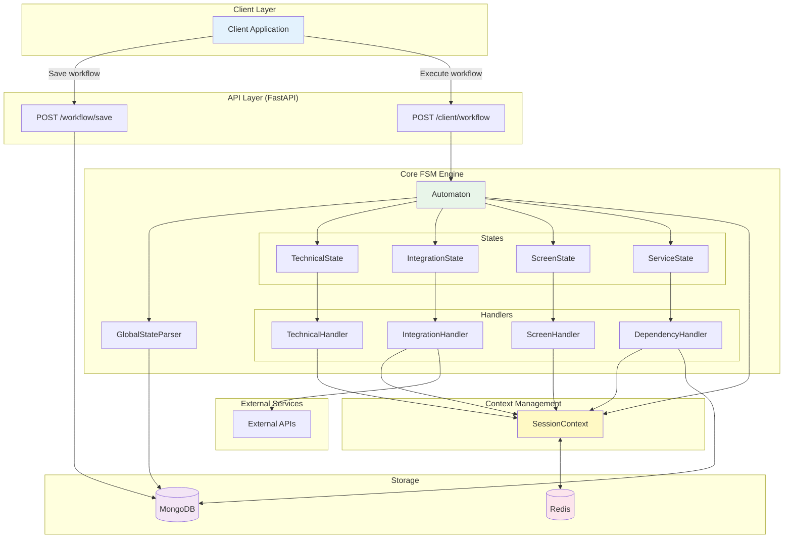

# Диаграммы классов и структур данных LCT EFS

## 1. Class Diagram - Core Components



---

## 2. Expression Type Hierarchy



---

## 3. Handler Creator Pattern



---

## 4. Data Models



---

## 5. API Request/Response Models



---

## 6. Storage Layer Structure



---

## 7. State Lifecycle Diagram



---

## 8. Context Data Flow

```mermaid
graph TB
    subgraph "MongoDB"
        WF_DEF[Workflow Definition<br/>states collection]
        WF_CTX[Predefined Context<br/>workflows collection]
    end
    
    subgraph "Redis Cache"
        SESSION[session:{id}<br/>Current session data]
        STATE[state:{id}<br/>State metadata]
        WF_CACHE[workflow_context:{id}<br/>Cached workflow context]
        SCREEN[screen:{id}<br/>Screen cache]
    end
    
    subgraph "Automaton Runtime"
        CTX[SessionContext<br/>Active context]
        HANDLERS[Handlers<br/>Execute logic]
    end
    
    WF_DEF -->|Load on init| Automaton
    WF_CTX -->|Lazy load| WF_CACHE
    WF_CACHE -->|Merge| CTX
    
    SESSION <-->|Read/Write| CTX
    STATE <-->|Checkpoint| CTX
    
    CTX <-->|Variables| HANDLERS
    HANDLERS -->|Update| CTX
    
    CTX -->|Auto-save on exit| SESSION
    
    style SESSION fill:#e1f5fe
    style STATE fill:#e1f5fe
    style WF_CACHE fill:#e1f5fe
    style SCREEN fill:#e1f5fe
    
    style WF_DEF fill:#f3e5f5
    style WF_CTX fill:#f3e5f5
    
    style CTX fill:#e8f5e9
    style HANDLERS fill:#e8f5e9
```

---

## 9. Expression Binding Mechanism



---

## 10. Complete System Architecture



---

## Key Design Patterns

### 1. **Registry Pattern**
```python
state_mapping: dict[StateTypeEnum, Type[BaseHandlersCreator]] = {
    StateTypeEnum.technical: WorkflowTechnicalHandlersCreator,
    StateTypeEnum.integration: WorkflowIntegrationHandlersCreator,
    StateTypeEnum.screen: WorkflowScreenHandlersCreator,
    StateTypeEnum.service: WorkflowDependencyHandlersCreator,
}
```

### 2. **Factory Pattern**
- `BaseHandlersCreator` создает handlers на основе типа состояния
- `Automaton.build_state()` создает состояния из моделей

### 3. **Singleton Pattern**
- `RedisCache` использует `GeneralPurposeSingletonMeta`

### 4. **Context Manager Pattern**
- `SessionContext` с автоматическим сохранением при `__exit__`

### 5. **Strategy Pattern**
- Различные `Handler` классы для разных типов выражений

### 6. **Decorator Pattern**
- `@check_context_consistency` для валидации переменных
- `@execute_safe` для безопасных внешних вызовов

---

## Type Relationships

```python
# State → Handler mapping
TechnicalState      → TechnicalHandler      → TechnicalStateExpression
IntegrationState    → IntegrationHandler    → IntegrationStateExpression  
ScreenState         → ScreenHandler         → ScreenStateExpression
ServiceState        → DependencyHandler     → ServiceStateExpression

# Expression → Transition binding
Technical/Integration: expression.variable ∈ transition.variables
Screen:               expression.event_name ∈ transition.keys
```

---

## Data Persistence Strategy

| Data Type | Storage | Key Pattern | Lifetime |
|-----------|---------|-------------|----------|
| Workflow Definition | MongoDB | `states` collection | Permanent |
| Predefined Context | MongoDB | `workflows` collection | Permanent |
| Session Data | Redis | `session:{id}` | Session (TTL) |
| State Metadata | Redis | `state:{id}` | Session |
| Workflow Context Cache | Redis | `workflow_context:{id}` | Cached |
| Screen Data | Redis | `screen:{id}` | Short (1s) |
