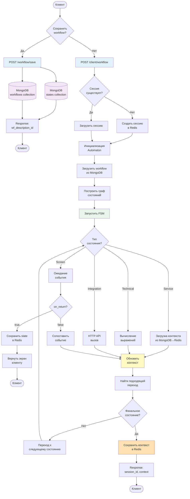
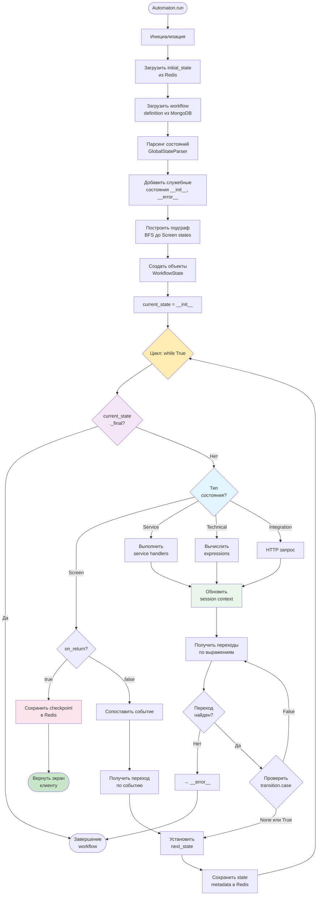
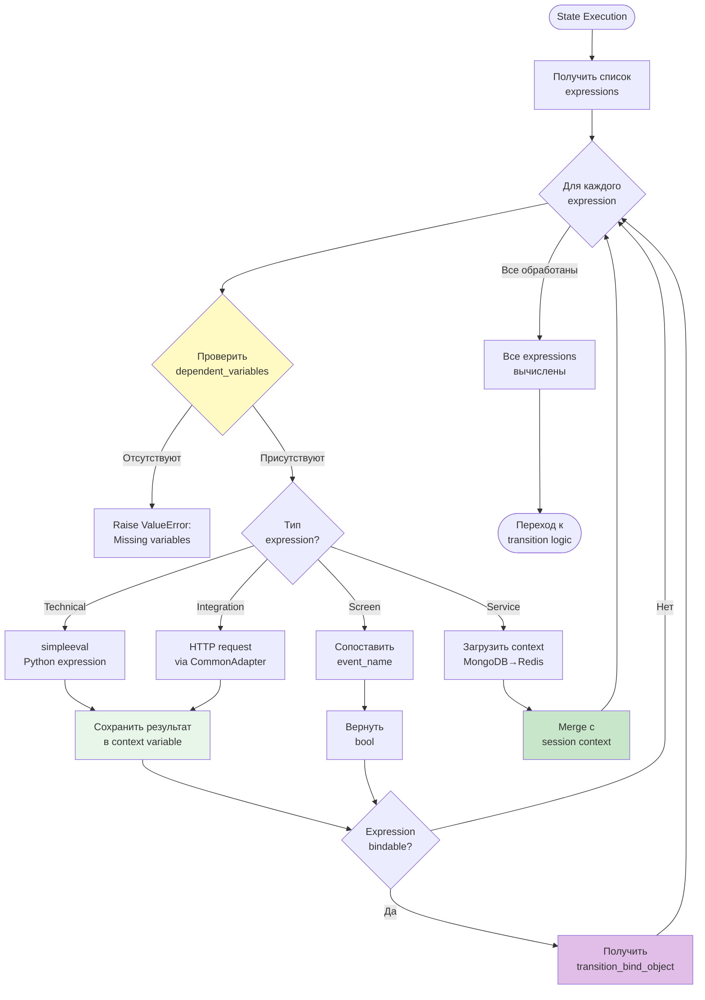
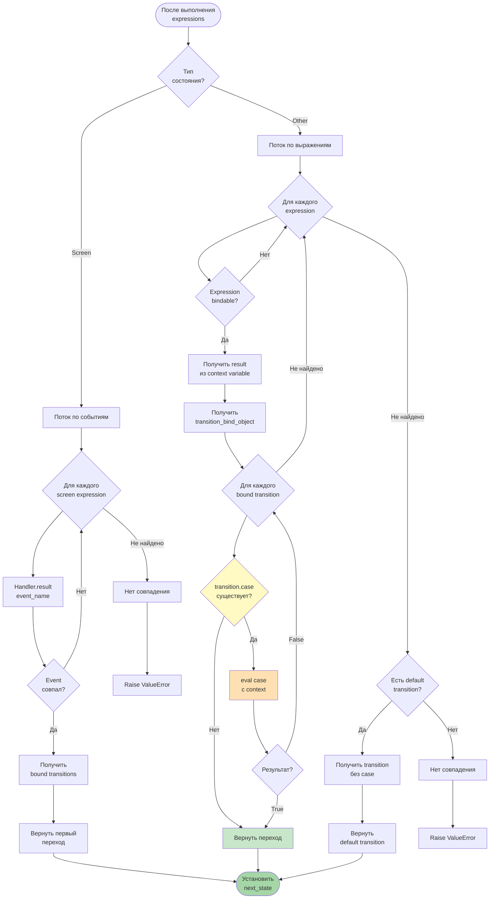
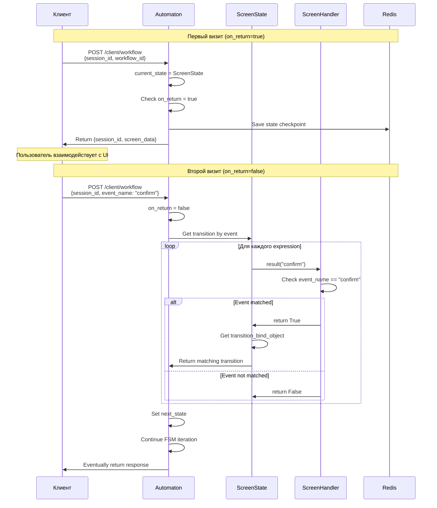
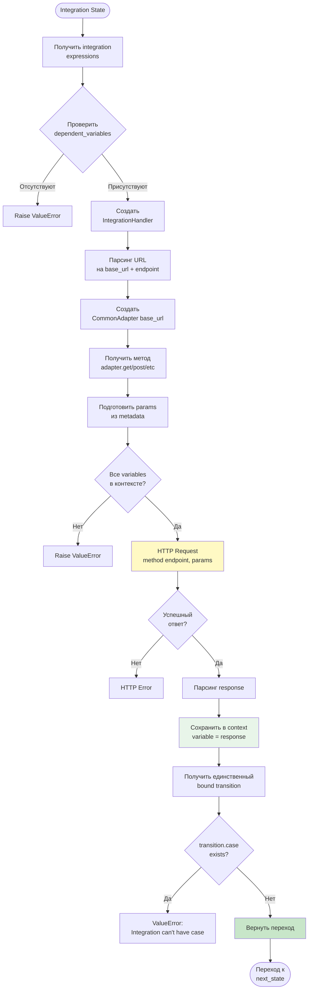
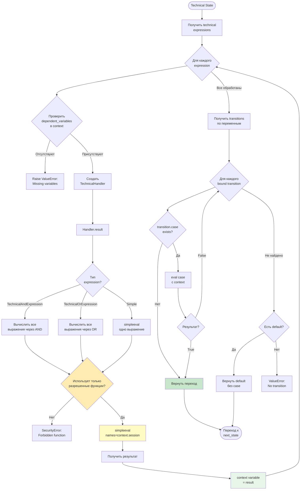

# Диаграммы потоков данных LCT EFS

## 1. Общий поток данных в системе



---

## 2. Детальный поток выполнения Automaton



---

## 3. Поток управления контекстом

```mermaid
flowchart LR
    subgraph Client["Клиент"]
        Request[HTTP Request]
        Response[HTTP Response]
    end
    
    subgraph API["API Layer"]
        Route[Route Handler]
    end
    
    subgraph Automaton["Automaton Engine"]
        Auto[Automaton]
        CtxMgr[SessionContext]
    end
    
    subgraph Handlers["State Handlers"]
        TechH[TechnicalHandler]
        IntegH[IntegrationHandler]
        ScreenH[ScreenHandler]
        DepH[DependencyHandler]
    end
    
    subgraph Storage["Storage Layer"]
        RedisSession[(Redis<br/>session:{id})]
        RedisState[(Redis<br/>state:{id})]
        RedisWFCtx[(Redis<br/>workflow_context:{id})]
        MongoWF[(MongoDB<br/>workflows)]
    end
    
    Request --> Route
    Route --> Auto
    
    Auto -->|with SessionContext| CtxMgr
    CtxMgr -->|__enter__<br/>load| RedisSession
    
    Auto --> TechH
    Auto --> IntegH
    Auto --> ScreenH
    Auto --> DepH
    
    TechH -->|read/write| CtxMgr
    IntegH -->|read/write| CtxMgr
    ScreenH -->|read/write| CtxMgr
    DepH -->|read/write| CtxMgr
    
    DepH -->|lazy load| MongoWF
    MongoWF -->|cache| RedisWFCtx
    RedisWFCtx -->|merge| CtxMgr
    
    Auto -->|checkpoint| RedisState
    
    CtxMgr -->|__exit__<br/>save| RedisSession
    
    Auto --> Route
    Route --> Response
    
    style CtxMgr fill:#fff9c4
    style RedisSession fill:#e1f5fe
    style RedisState fill:#e1f5fe
    style RedisWFCtx fill:#e1f5fe
    style MongoWF fill:#f3e5f5
```

---

## 4. Поток обработки выражений



---

## 5. Поток выбора перехода



---

## 6. Поток сохранения и загрузки workflow

```mermaid
flowchart TB
    subgraph Save["Сохранение Workflow"]
        S1[Клиент отправляет<br/>POST /workflow/save]
        S2[API получает<br/>StateSet + context]
        S3[Сериализация states<br/>в JSON]
        S4[Сохранение в MongoDB<br/>states collection]
        S5[Генерация workflow_id]
        S6[Сохранение context<br/>с тем же ID]
        S7[Возврат IDs клиенту]
        
        S1 --> S2 --> S3 --> S4 --> S5 --> S6 --> S7
    end
    
    subgraph Load["Загрузка Workflow"]
        L1[Automaton.__init__]
        L2[GlobalStateParser<br/>инициализация]
        L3[MongoDB.get<br/>workflow_id]
        L4[Десериализация<br/>JSON → StateModel]
        L5[Добавление<br/>__init__, __error__]
        L6[get_automaton_subgraph<br/>BFS обход]
        L7[Создание<br/>WorkflowState объектов]
        
        L1 --> L2 --> L3 --> L4 --> L5 --> L6 --> L7
    end
    
    subgraph Context["Загрузка Context"]
        C1[DependencyHandler.init_result]
        C2[Проверка Redis<br/>workflow_context:{id}]
        C3{В кэше?}
        C4[MongoDB.get<br/>workflow_id]
        C5[Redis.set_workflow_context]
        C6[Redis.get_workflow_context]
        C7[Merge с session context]
        
        C1 --> C2 --> C3
        C3 -->|Нет| C4 --> C5 --> C7
        C3 -->|Да| C6 --> C7
    end
    
    S7 -.->|workflow_id| L1
    L7 -.->|Service state| C1
    
    style S4 fill:#f3e5f5
    style S6 fill:#f3e5f5
    style L3 fill:#f3e5f5
    style C4 fill:#f3e5f5
    style C5 fill:#e1f5fe
    style C6 fill:#e1f5fe
    style C7 fill:#c8e6c9
```

---

## 7. Поток обработки Screen State



---

## 8. Поток интеграции с внешним API



---

## 9. Поток обработки Technical State



---

## 10. Полный цикл: от запроса до ответа

```mermaid
flowchart TB
    Start([🔵 START]) --> ClientReq[📱 Клиент:<br/>POST /client/workflow]
    
    ClientReq --> APIRoute[🌐 API Route Handler]
    APIRoute --> CheckSess{🔍 Сессия<br/>существует?}
    
    CheckSess -->|❌ Нет| CreateSess[➕ Redis:<br/>create_session]
    CheckSess -->|✅ Да| LoadSess[📥 Redis:<br/>get_session]
    
    CreateSess --> InitAuto[⚙️ Automaton:<br/>__init__]
    LoadSess --> InitAuto
    
    InitAuto --> LoadDef[📚 MongoDB:<br/>Load workflow definition]
    LoadDef --> ParseDef[🔧 GlobalStateParser:<br/>Parse states]
    ParseDef --> BuildGraph[🔗 Build state graph<br/>BFS]
    BuildGraph --> CreateStates[🏗️ Create WorkflowState<br/>objects]
    
    CreateStates --> StartRun[▶️ Automaton.run]
    StartRun --> FSMLoop{🔄 FSM Loop<br/>while not final}
    
    FSMLoop --> StateType{❓ State Type?}
    
    StateType -->|🔧 Service| ExecService[🛠️ Load context<br/>MongoDB→Redis]
    StateType -->|📐 Technical| ExecTech[🧮 Evaluate<br/>expressions]
    StateType -->|🌐 Integration| ExecInteg[📡 HTTP API<br/>call]
    StateType -->|🖥️ Screen| ExecScreen[👁️ Check<br/>on_return]
    
    ExecService --> UpdateCtx1[💾 Update<br/>context]
    ExecTech --> UpdateCtx1
    ExecInteg --> UpdateCtx1
    ExecScreen --> CheckReturn{🔀 on_return?}
    
    CheckReturn -->|✅ true| SaveCheckpoint[📌 Save checkpoint<br/>to Redis]
    SaveCheckpoint --> ReturnScreen[⏸️ Return screen<br/>to client]
    ReturnScreen --> ClientResp1[📤 Response to Client]
    ClientResp1 --> End1([🟢 END - Screen Returned])
    
    CheckReturn -->|❌ false| MatchEvt[🎯 Match event]
    MatchEvt --> UpdateCtx2[💾 Update<br/>context]
    
    UpdateCtx1 --> FindTrans[🔍 Find matching<br/>transition]
    UpdateCtx2 --> FindTrans
    
    FindTrans --> CheckTransFound{✅ Transition<br/>found?}
    CheckTransFound -->|❌ No| ErrorState[❌ → __error__]
    ErrorState --> SaveErr[💾 Save error state]
    SaveErr --> ClientResp2[📤 Error Response]
    ClientResp2 --> End2([🔴 END - Error])
    
    CheckTransFound -->|✅ Yes| EvalCase{📋 Evaluate<br/>transition.case}
    EvalCase -->|✅ Match| SetNext[⏭️ Set next_state]
    EvalCase -->|❌ No match| FindTrans
    
    SetNext --> SaveStateMeta[💾 Save state<br/>metadata to Redis]
    SaveStateMeta --> CheckFinal{🏁 Final<br/>state?}
    
    CheckFinal -->|❌ No| FSMLoop
    CheckFinal -->|✅ Yes| SaveFinal[💾 Save final<br/>context to Redis]
    SaveFinal --> ClientResp3[📤 Final Response]
    ClientResp3 --> End3([🟢 END - Workflow Complete])
    
    style Start fill:#4CAF50,color:#fff
    style End1 fill:#4CAF50,color:#fff
    style End2 fill:#f44336,color:#fff
    style End3 fill:#4CAF50,color:#fff
    style FSMLoop fill:#FFC107
    style UpdateCtx1 fill:#2196F3,color:#fff
    style UpdateCtx2 fill:#2196F3,color:#fff
    style SaveCheckpoint fill:#9C27B0,color:#fff
    style ReturnScreen fill:#00BCD4,color:#fff
```



---

## Легенда символов

| Символ | Значение |
|--------|----------|
| 🔵 | Точка входа |
| 🟢 | Успешное завершение |
| 🔴 | Завершение с ошибкой |
| 📱 | Клиентский запрос |
| 🌐 | API endpoint |
| 📚 | MongoDB операция |
| 💾 | Redis операция |
| ⚙️ | Инициализация компонента |
| 🔄 | Цикл |
| ❓ | Условие/проверка |
| ⏭️ | Переход к следующему |
| 🔧 | Service state |
| 📐 | Technical state |
| 🌐 | Integration state |
| 🖥️ | Screen state |
| 🧮 | Вычисление |
| 📡 | Внешний API вызов |
| 👁️ | Проверка |
| 🎯 | Сопоставление |
| 📌 | Checkpoint |
| ⏸️ | Приостановка |
| 🏁 | Финальное состояние |

---

## Ключевые точки потока

### 1. **Точки принятия решений**
- Существование сессии → создание или загрузка
- Тип состояния → выбор обработчика
- on_return флаг → возврат экрана или продолжение
- Финальное состояние → завершение или итерация

### 2. **Точки персистентности**
- Создание сессии → Redis `session:{id}`
- Checkpoint состояния → Redis `state:{id}`
- Контекст workflow → Redis `workflow_context:{id}`
- Финальный контекст → Redis `session:{id}` update

### 3. **Точки взаимодействия с внешними системами**
- Загрузка workflow → MongoDB `states`
- Загрузка контекста → MongoDB `workflows`
- Integration state → Внешние HTTP API
- DependencyHandler → MongoDB → Redis (lazy loading)

### 4. **Точки возврата клиенту**
- Screen state (on_return=true) → частичный результат
- Final state → полный результат
- Error state → ошибка выполнения
