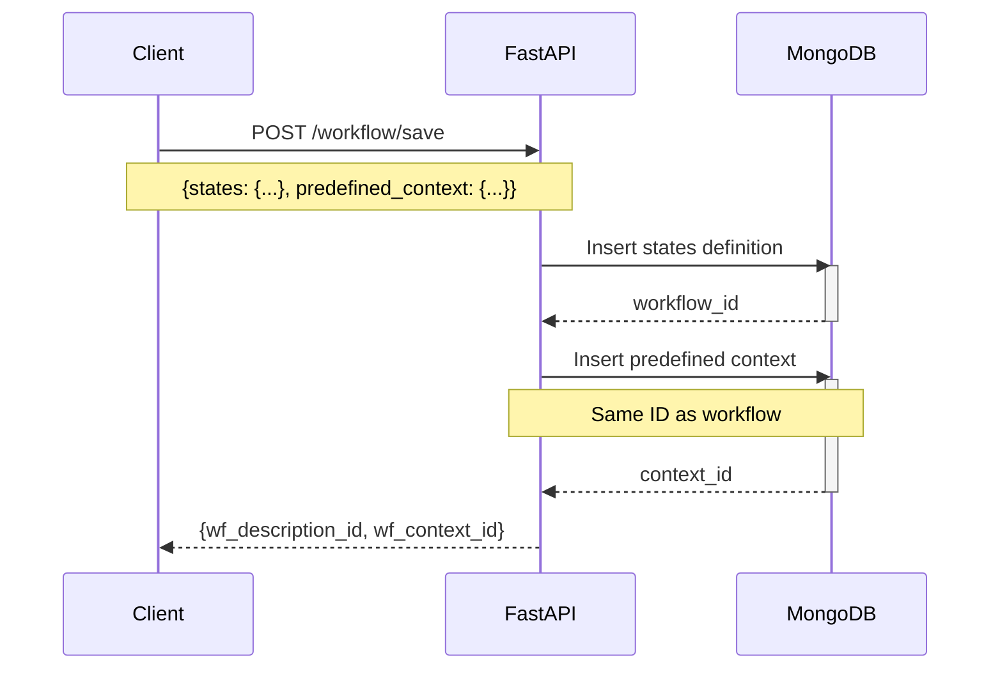
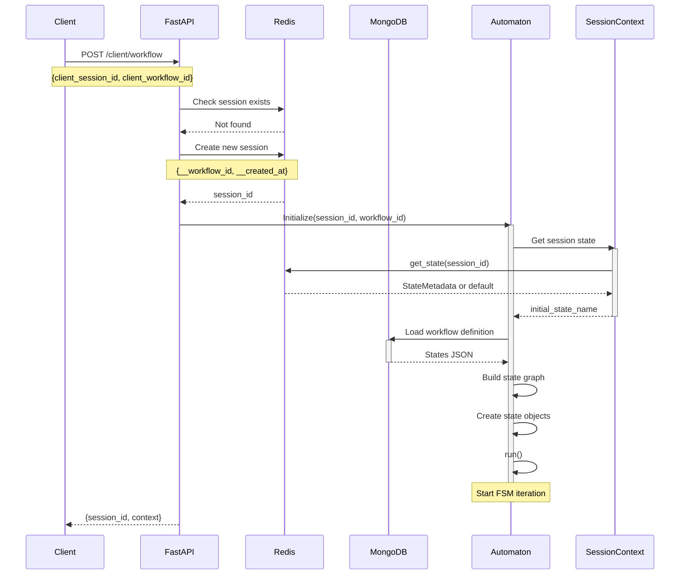
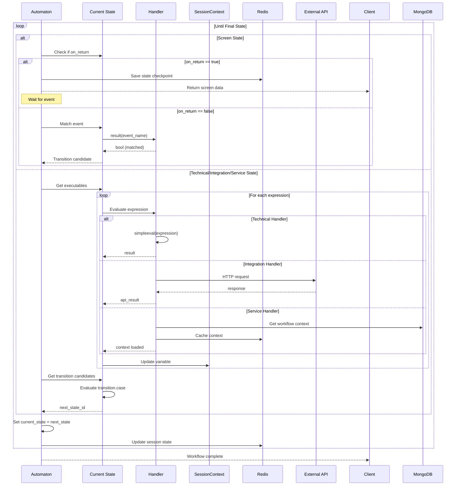
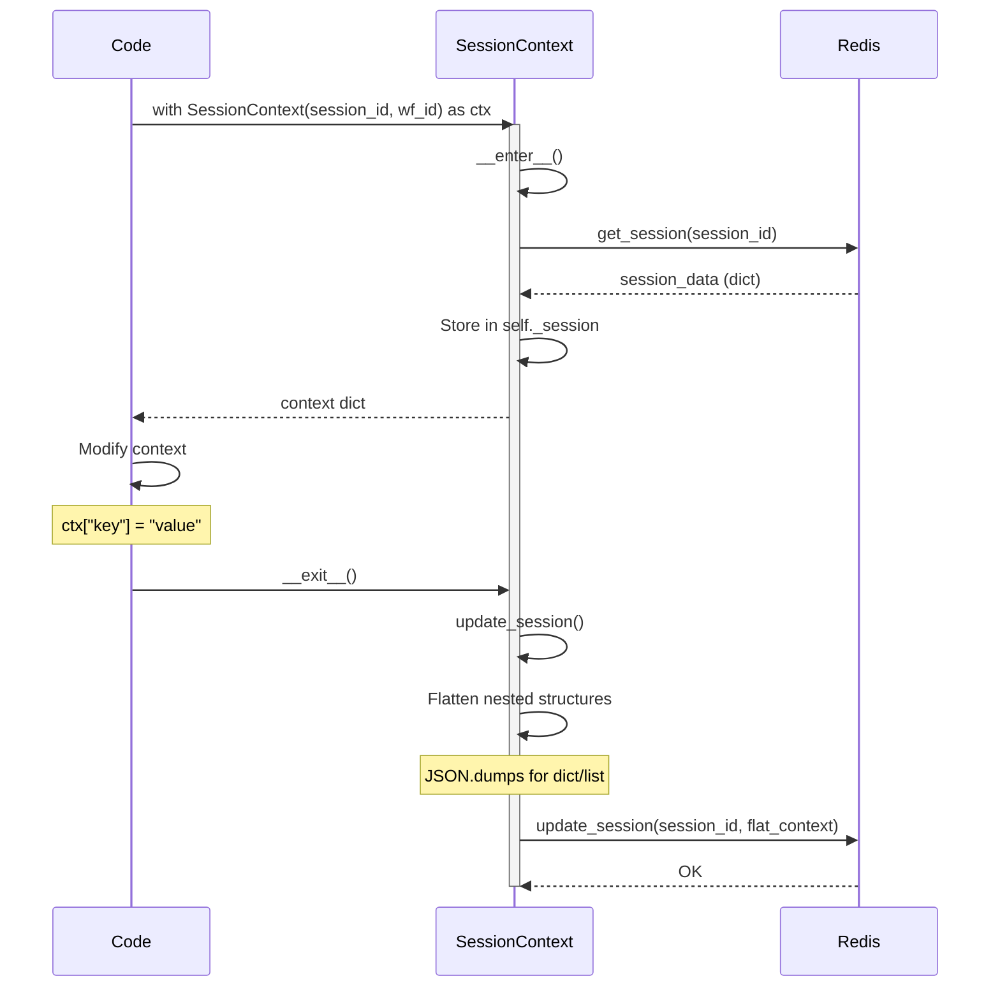
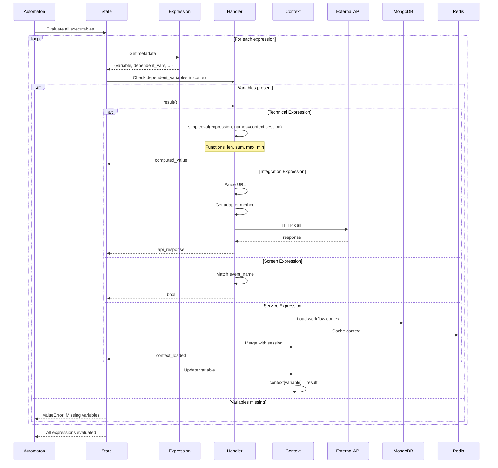
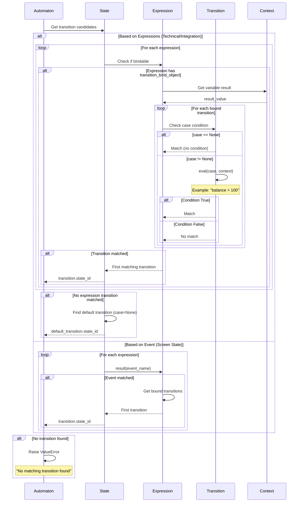
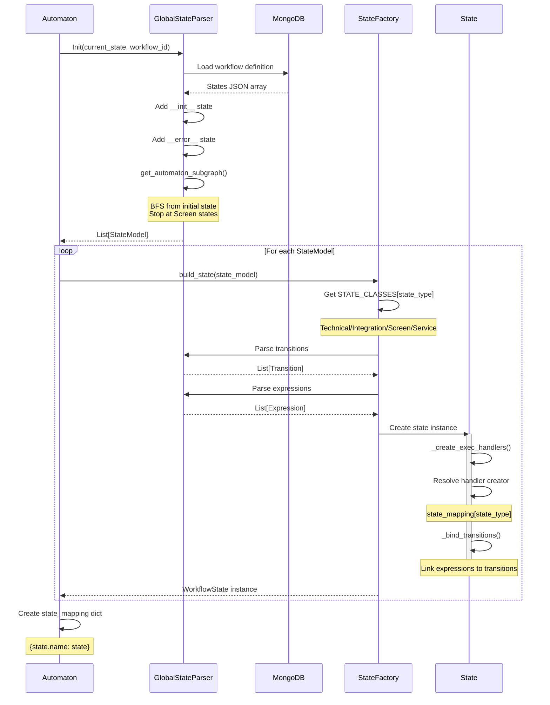
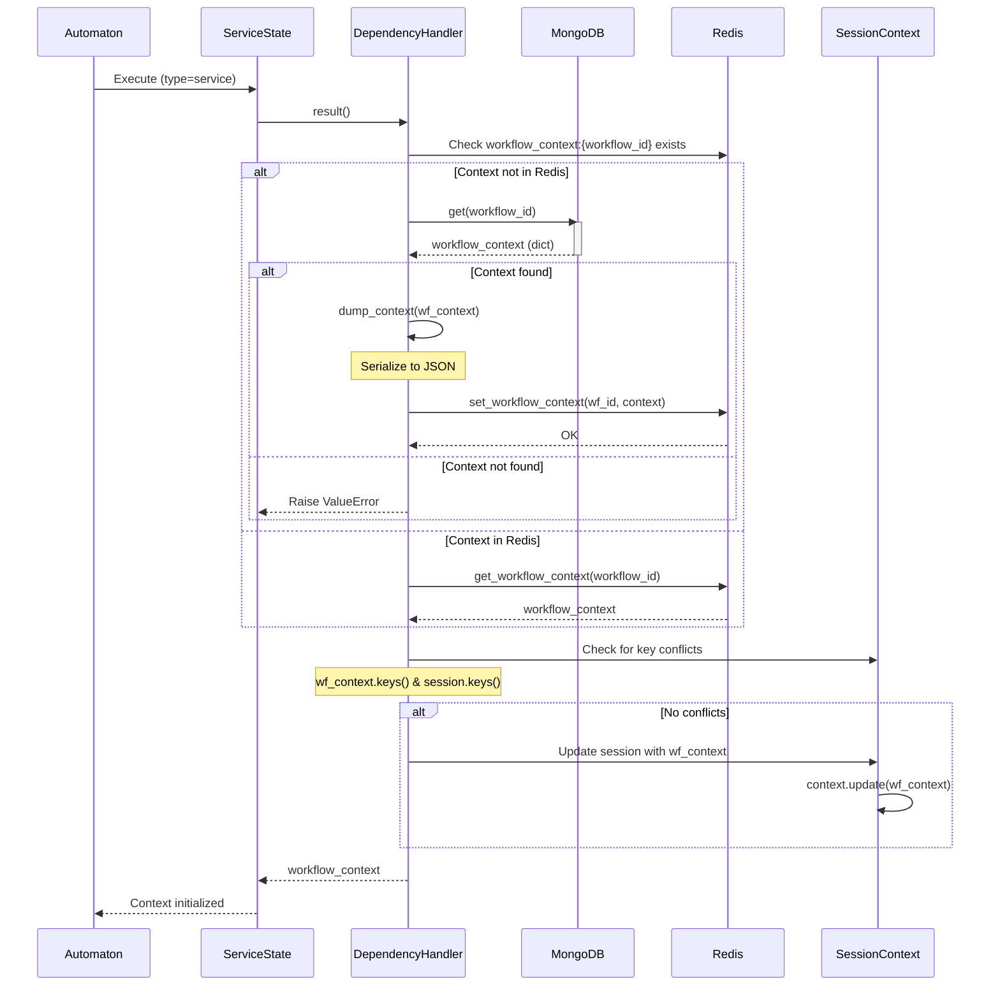
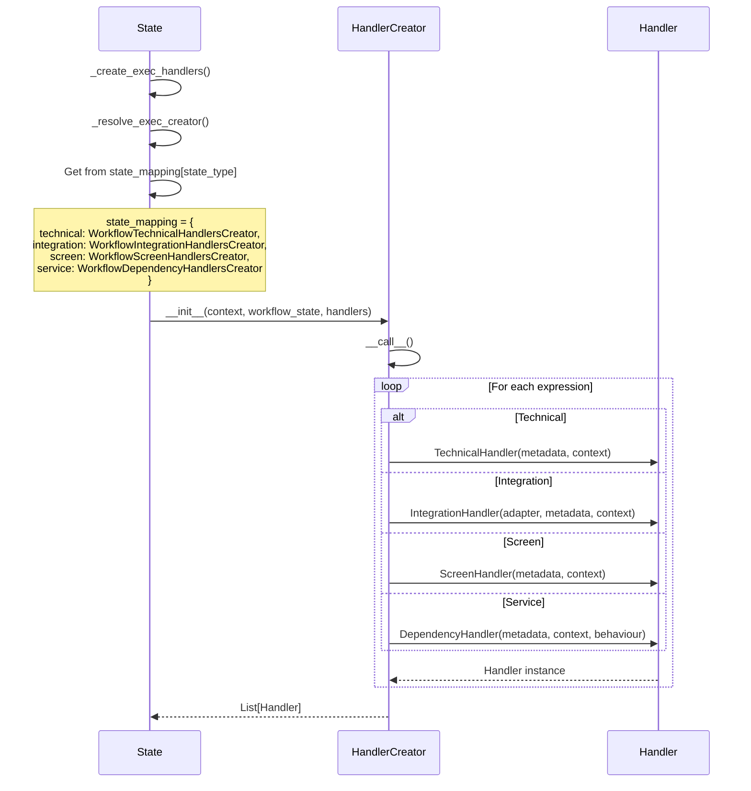
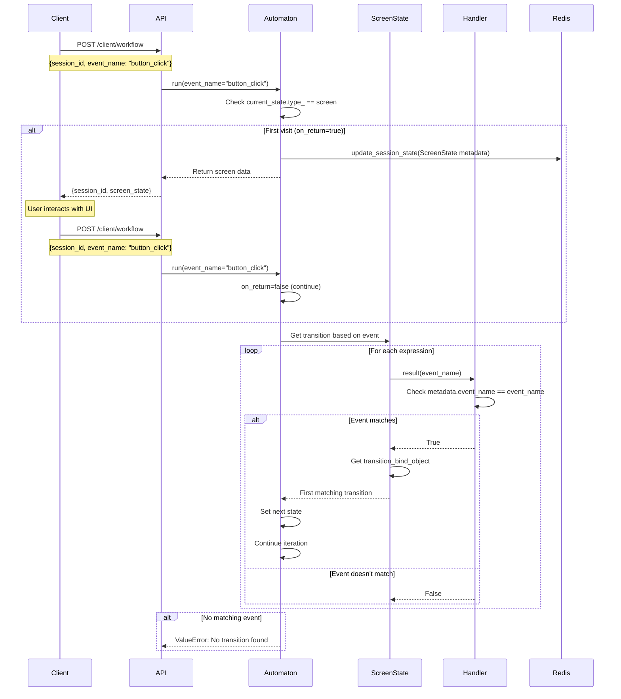

# Диаграммы последовательности LCT EFS

## 1. Создание и сохранение Workflow

---

## 2. Запуск Workflow (новая сессия)

---

## 3. Workflow Execution (Iteration Loop)

---

## 4. Context Management Lifecycle

---

## 5. Expression Evaluation Flow

---

## 6. Transition Selection Process

---

## 7. State Creation and Graph Building

---

## 8. Dependency (Service) State Initialization

---

## 9. Handler Creation Pattern

---

## 10. Screen State Event Handling

---

## Ключевые моменты

### 🔄 Циклическая природа FSM
- Автомат итерируется в бесконечном цикле `while True`
- Выход происходит при достижении `final_state` или `Screen` состояния (на первом посещении)

### 🎯 Два режима работы Screen State
1. **on_return=True**: Возврат экрана клиенту, сохранение состояния
2. **on_return=False**: Обработка события, переход к следующему состоянию

### 🔗 Связывание Transitions и Expressions
- Происходит в методе `_bind_transitions()` каждого состояния
- Для Technical/Integration: по `variable`
- Для Screen: по `event_name`

### 📦 Context Manager Pattern
- `SessionContext` автоматически сохраняет изменения при выходе из блока `with`
- Thread-safe операции с контекстом

### 🛡️ Безопасность выполнения
- `simpleeval` для изолированного выполнения Python кода
- Ограниченный набор функций: `len`, `sum`, `max`, `min`
- Валидация наличия всех `dependent_variables` перед выполнением
