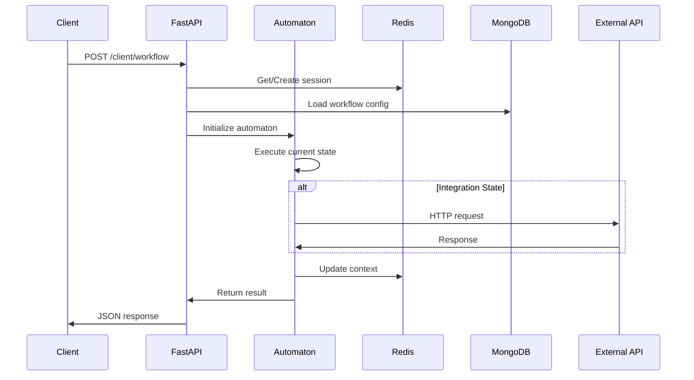

# 🏗️ Архитектура LCT EFS

## Обзор системы

LCT EFS построена по принципу микросервисной архитектуры с четким разделением ответственности между компонентами.

## Слои архитектуры

### 1. Presentation Layer (Слой представления)
- **API Gateway** - FastAPI сервер с CORS middleware
- **Routes** - HTTP маршруты для клиентских запросов
- **Schema Validation** - Pydantic схемы для валидации

### 2. Business Logic Layer (Слой бизнес-логики)
- **Automaton** - Ядро автомата состояний
- **State Parser** - Парсер конфигураций workflow
- **Context Manager** - Управление контекстом сессий

### 3. Data Access Layer (Слой доступа к данным)
- **Redis Service** - Кэширование сессий и контекста
- **MongoDB Client** - Хранение конфигураций workflow
- **PostgreSQL Client** - Реляционные данные (опционально)

### 4. Integration Layer (Слой интеграций)
- **HTTP Adapters** - Унифицированные адаптеры для внешних API
- **External Services** - Интеграция с внешними системами

## Паттерны проектирования

### State Machine Pattern
Основа системы - конечный автомат (FSM) для управления состояниями:

```python
class Automaton:
    def __init__(self):
        self.current_state = None
        self.context = {}
        
    def transition(self, event):
        # Логика перехода между состояниями
        pass
```

### Strategy Pattern
Различные типы состояний реализуют общий интерфейс:

```python
class StateHandler(ABC):
    @abstractmethod
    def execute(self, context: dict) -> dict:
        pass

class ScreenStateHandler(StateHandler):
    def execute(self, context: dict) -> dict:
        # Обработка экранного состояния
        pass
```

### Repository Pattern
Унифицированный доступ к данным:

```python
class WorkflowRepository:
    def get_workflow(self, workflow_id: str):
        # Получение workflow из MongoDB
        pass
        
    def save_workflow(self, workflow: dict):
        # Сохранение workflow в MongoDB
        pass
```

## Жизненный цикл запроса



## Компоненты системы

### Automaton (Автомат состояний)
Основной движок для выполнения workflow:
- Управление переходами между состояниями
- Выполнение логики состояний
- Обновление контекста

### State Parser
Парсер JSON конфигураций:
- Валидация структуры workflow
- Создание графа состояний
- Оптимизация переходов

### Context Manager
Управление сессионным контекстом:
- Хранение в Redis с TTL
- Сериализация/десериализация
- Изоляция сессий

## Масштабируемость

### Горизонтальное масштабирование
- Stateless API серверы
- Shared state в Redis
- Load balancer для распределения нагрузки

### Вертикальное масштабирование
- Оптимизация запросов к БД
- Кэширование конфигураций workflow
- Пулинг соединений

## Безопасность

### Аутентификация и авторизация
- JWT токены (планируется)
- RBAC для доступа к workflow
- Rate limiting

### Валидация данных
- Pydantic схемы для всех входных данных
- Санитизация контекста
- Защита от injection атак

## Мониторинг и наблюдаемость

### Логирование
- Структурированные логи в JSON
- Correlation ID для трассировки
- Различные уровни логирования

### Метрики
- Время выполнения состояний
- Количество активных сессий
- Ошибки интеграций

### Health Checks
- `/healthcheck` endpoint
- Проверка доступности БД
- Мониторинг внешних зависимостей

## Развертывание

### Локальная разработка
```bash
# Виртуальное окружение
python -m venv .venv
.venv\Scripts\activate
pip install -r deployments/requirements.txt

# Инфраструктура
docker-compose up -d

# API сервер
uvicorn api.app:app --reload --port 8080
```

### Production
```bash
# Docker
docker build -f deployments/Dockerfile -t lct-efs:latest .
docker run -p 8080:8080 lct-efs:latest

# Kubernetes
kubectl apply -f deployments/middle_back_deployment.yaml
```

## Производительность

### Оптимизации
- Async/await для I/O операций
- Connection pooling для БД
- Кэширование workflow конфигураций
- Batch операции для массовых обновлений

### Benchmarks
- < 100ms для простых состояний
- < 500ms для интеграционных состояний
- 1000+ RPS на одном сервере

## Расширяемость

### Добавление новых типов состояний
1. Создать enum в `StateTypeEnum`
2. Реализовать handler в Automaton
3. Добавить валидацию в схемы
4. Обновить документацию

### Новые адаптеры
1. Наследоваться от `BaseAdapter`
2. Реализовать методы интеграции
3. Добавить конфигурацию
4. Создать тесты

## Troubleshooting

### Частые проблемы
- **Workflow не найден**: Проверить ID в MongoDB
- **Сессия не создается**: Проверить подключение к Redis
- **Интеграция не работает**: Проверить URL и аутентификацию

### Отладка
- Включить DEBUG логирование
- Использовать `/healthcheck` для проверки зависимостей
- Проверить структуру workflow через валидатор
